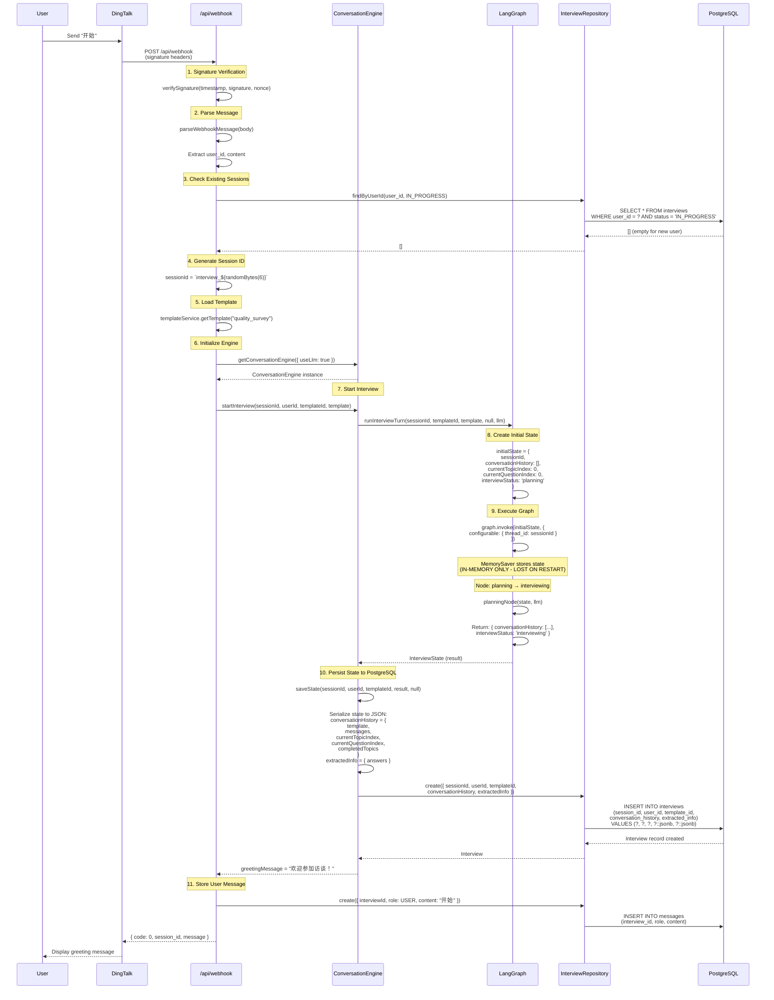
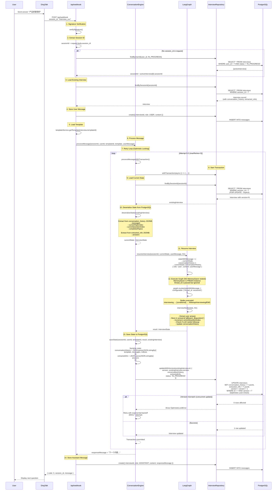
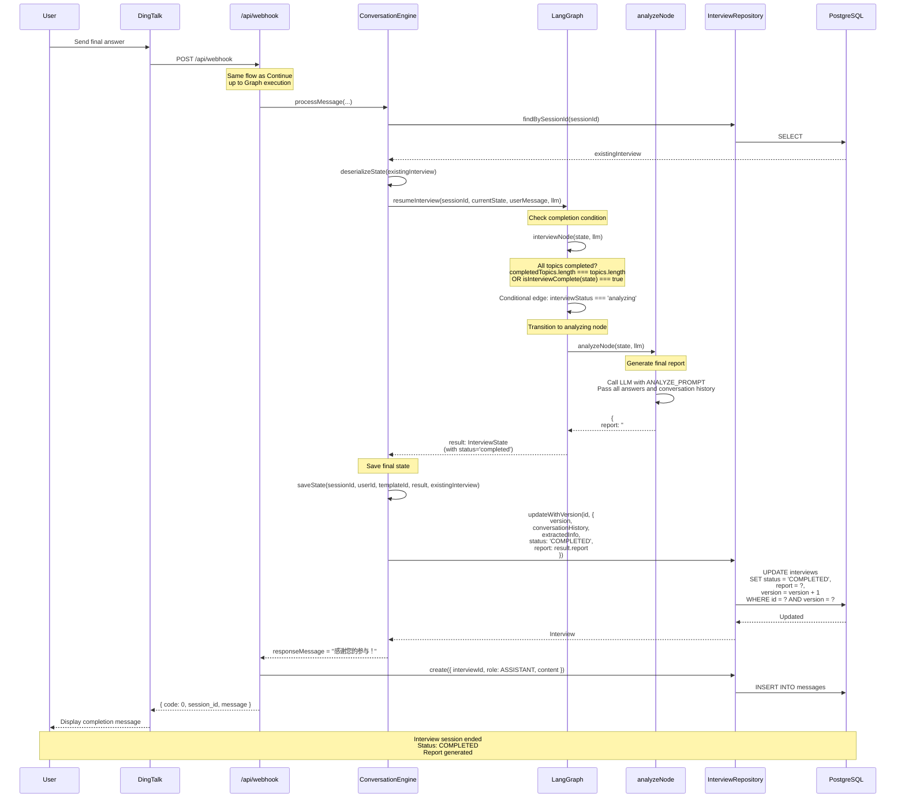

# Multi-Turn Interview Conversation Flow Analysis

**Generated:** 2026-04-02
**Purpose:** Technical documentation of multi-turn interview session management

---

## Executive Summary

The interview-bot uses a **dual persistence architecture**:

1. **LangGraph MemorySaver** - In-memory checkpointer (NON-PERSISTENT)
2. **PostgreSQL via ConversationEngine** - Database persistence (PERSISTENT)

**Critical Finding:** MemorySaver is recreated on each server restart, making it unreliable for session persistence. The actual session continuity relies entirely on PostgreSQL state serialization/deserialization.

---

## 1. Interview Start Flow (访谈开始)

### Sequence Diagram



### Key Points (访谈开始关键点)

1. **Session ID Generation**: `interview_${randomBytes(6).toString('hex')}`
2. **State Initialization**:
   - `currentTopicIndex: 0`
   - `currentQuestionIndex: 0`
   - `conversationHistory: []`
   - `interviewStatus: 'planning'`
3. **Dual Persistence**:
   - MemorySaver stores state in RAM (thread_id = sessionId)
   - PostgreSQL stores serialized state in `conversation_history` and `extracted_info` JSONB fields
4. **Template Loading**: Falls back through `quality_survey` → `customer_feedback` → `default`

---

## 2. Interview Continue Flow (访谈接续)

### Sequence Diagram



### Key Points (访谈接续关键点)

1. **Session Lookup Priority**:
   - First: `request.body.session_id` (from DingTalk callback)
   - Fallback: `findByUserId(user_id, IN_PROGRESS)` (active sessions)

2. **State Deserialization** (from PostgreSQL):

   ```typescript
   // From conversation_history JSONB:
   - messages: conversationHistory
   - currentTopicIndex
   - currentQuestionIndex
   - completedTopics

   // From extracted_info JSONB:
   - answers
   ```

3. **MemorySaver Issue**:
   - MemorySaver is created FRESH in `createInterviewGraph()`
   - `thread_id` is passed but state is NOT restored from MemorySaver
   - State comes entirely from PostgreSQL deserialization

4. **Optimistic Locking**:
   - Each update checks `WHERE version = expected_version`
   - On conflict: retry up to 3 times with exponential backoff
   - Prevents lost updates from concurrent requests

5. **State Update Flow**:
   ```
   PostgreSQL → deserialize → Graph execution → serialize → PostgreSQL
   ```

---

## 3. Interview End Flow (访谈结束)

### Sequence Diagram



### Key Points (访谈结束关键点)

1. **Completion Trigger**:
   - `isInterviewComplete(state)` returns true
   - OR all topics have been covered: `completedTopics.length === template.topics.length`

2. **Report Generation**:
   - `analyzeNode` calls LLM with all collected answers
   - Uses `ANALYZE_PROMPT` template
   - Generates Markdown report

3. **Final State Update**:
   - `interviewStatus: 'completed'`
   - `endTime: new Date()`
   - `report: string` (Markdown content)
   - Database `status: 'COMPLETED'`

---

## 4. Session Persistence Mechanism (会话保持机制)

### Data Flow Architecture

```
┌─────────────────────────────────────────────────────────────────┐
│                     Webhook Request                              │
│                   POST /api/webhook                              │
└──────────────────────────┬──────────────────────────────────────┘
                           │
                           ▼
┌─────────────────────────────────────────────────────────────────┐
│                   ConversationEngine                             │
│  ┌───────────────────────────────────────────────────────────┐  │
│  │  processMessage() / startInterview()                      │  │
│  │  ┌─────────────────────────────────────────────────────┐  │  │
│  │  │  Transaction (Optimistic Lock Retry Loop)          │  │  │
│  │  │  ┌───────────────────────────────────────────────┐  │  │  │
│  │  │  │  1. findBySessionId() → PostgreSQL            │  │  │  │
│  │  │  │  2. deserializeState()                        │  │  │  │
│  │  │  │  3. resumeInterview() / runInterviewTurn()    │  │  │  │
│  │  │  │  4. saveState() → PostgreSQL                  │  │  │  │
│  │  │  └───────────────────────────────────────────────┘  │  │  │
│  │  └─────────────────────────────────────────────────────┘  │  │
│  └───────────────────────────────────────────────────────────┘  │
└─────────────────────────────────────────────────────────────────┘
                           │
         ┌─────────────────┴─────────────────┐
         │                                   │
         ▼                                   ▼
┌──────────────────────┐          ┌──────────────────────┐
│   LangGraph Graph    │          │   PostgreSQL DB      │
│  ┌────────────────┐  │          │  ┌────────────────┐  │
│  │ MemorySaver    │  │          │  │ interviews     │  │
│  │ (IN-MEMORY)    │  │          │  │ ├─ id          │  │
│  │ ├─ thread_id   │  │          │  │ ├─ session_id  │  │
│  │ └─ state       │  │          │  │ ├─ user_id     │  │
│  │                │  │          │  │ ├─ version     │  │
│  │ ⚠️ LOST ON     │  │          │  │ ├─ status      │  │
│  │    RESTART!    │  │          │  │ ├─ conversation│  │
│  │                │  │          │  │ │  _history    │  │
│  │                │  │          │  │ │  (JSONB)     │  │
│  │                │  │          │  │ ├─ extracted_  │  │
│  │                │  │          │  │ │  info (JSONB)│  │
│  │                │  │          │  │ └─ report      │  │
│  └────────────────┘  │          │  └────────────────┘  │
└──────────────────────┘          └──────────────────────┘
        ❌ NOT USED                      ✅ ACTUAL SOURCE
        FOR RECOVERY                     OF TRUTH
```

### PostgreSQL Schema (数据模型)

```sql
CREATE TABLE interviews (
    id UUID PRIMARY KEY DEFAULT uuid_generate_v4(),
    session_id VARCHAR UNIQUE NOT NULL,
    user_id VARCHAR NOT NULL,
    template_id VARCHAR NOT NULL,
    status VARCHAR DEFAULT 'IN_PROGRESS', -- IN_PROGRESS, COMPLETED, CANCELLED
    topic VARCHAR,

    -- State Persistence (JSONB)
    conversation_history JSONB,  -- { template, messages, currentTopicIndex, currentQuestionIndex, completedTopics }
    extracted_info JSONB,        -- { answers: { q0_0: "answer1", q0_1: "answer2", ... } }

    report TEXT,
    report_path VARCHAR,

    version INT DEFAULT 0,       -- Optimistic locking
    created_at TIMESTAMP DEFAULT NOW(),
    updated_at TIMESTAMP DEFAULT NOW(),

    INDEX idx_session_id (session_id),
    INDEX idx_user_id (user_id),
    INDEX idx_status (status)
);

CREATE TABLE messages (
    id UUID PRIMARY KEY DEFAULT uuid_generate_v4(),
    interview_id UUID REFERENCES interviews(id) ON DELETE CASCADE,
    role VARCHAR NOT NULL,      -- USER, ASSISTANT, SYSTEM
    content TEXT NOT NULL,
    message_type VARCHAR,
    created_at TIMESTAMP DEFAULT NOW(),

    INDEX idx_interview_id (interview_id),
    INDEX idx_role (role)
);
```

### State Serialization Format (状态序列化格式)

**conversation_history JSONB:**

```json
{
  "template": {
    "id": "quality_survey",
    "name": "产品质量调查",
    "topics": [...],
    "questions": [...],
    "domain_context": "..."
  },
  "messages": [
    { "role": "assistant", "content": "欢迎参加访谈！" },
    { "role": "user", "content": "产品质量很好" },
    { "role": "assistant", "content": "下一个问题..." }
  ],
  "currentTopicIndex": 0,
  "currentQuestionIndex": 1,
  "completedTopics": []
}
```

**extracted_info JSONB:**

```json
{
  "answers": {
    "q0_0": "产品质量很好",
    "q0_1": "服务响应很快",
    "q1_0": "希望能增加更多功能"
  }
}
```

---

## 5. Critical Issues Identified (识别的关键问题)

### Issue 1: MemorySaver is Non-Persistent (关键问题)

**Problem:**

```typescript
// src/core/graph.ts:80
const checkpointer = new MemorySaver();
return workflow.compile({ checkpointer });
```

- MemorySaver stores state in RAM only
- On server restart, all checkpointer state is lost
- `thread_id` parameter is passed but ignored for recovery

**Impact:**

- State recovery relies 100% on PostgreSQL
- MemorySaver provides NO benefit for multi-turn persistence
- If ConversationEngine deserialization fails, session is lost

**Evidence:**

```typescript
// src/services/conversation/engine.ts:82-88
if (existingInterview) {
  const currentState = this.deserializeState(existingInterview); // ← From PostgreSQL
  result = await resumeInterview(
    sessionId,
    currentState, // ← Pass deserialized state
    userMessage,
    this.useLlm ? getDashScopeProvider() : undefined,
  );
}
```

### Issue 2: Unbounded Conversation History Growth

**Problem:**

```typescript
// src/core/nodes.ts:99 (interviewNode)
conversationHistory: [
  ...state.conversationHistory,
  { role: "assistant", content: llmResponse },
],
```

- `conversationHistory` always appends, never truncates
- Stored in PostgreSQL JSONB field
- Long interviews (50+ turns) will create large JSONB documents

**Mitigation (partial):**

```typescript
// src/core/nodes.ts:13
function buildHistory(state: InterviewState): Message[] {
  return state.conversationHistory.slice(-6); // Only last 6 messages to LLM
}
```

But full history is still stored in database!

### Issue 3: No Session Cleanup

**Problem:**

- No automatic cleanup of completed interviews
- No TTL (time-to-live) for abandoned sessions
- `CANCELLED` status exists but is never set automatically

### Issue 4: Version Field Not in InterviewState

**Problem:**

- `InterviewState` type doesn't include `version` field
- Optimistic locking happens at repository level only
- If state schema changes, old serialized states may fail

---

## 6. Recommendations (改进建议)

### High Priority

1. **Remove MemorySaver or Replace with PostgresSaver**

   ```typescript
   // Option A: Remove MemorySaver (state comes from DB anyway)
   return workflow.compile({}); // No checkpointer

   // Option B: Implement PostgresSaver
   import { PostgresSaver } from "@langchain/langgraph-checkpoint-postgres";
   const checkpointer = new PostgresSaver(connection);
   ```

2. **Add Conversation History Truncation**

   ```typescript
   // Keep last N messages in state
   const MAX_HISTORY = 20;
   conversationHistory: state.conversationHistory.slice(-MAX_HISTORY);
   ```

3. **Add Session Timeout**
   ```typescript
   // Auto-cancel sessions inactive for > 24 hours
   UPDATE interviews
   SET status = 'CANCELLED'
   WHERE status = 'IN_PROGRESS'
   AND updated_at < NOW() - INTERVAL '24 hours'
   ```

### Medium Priority

4. **Add Version to InterviewState**

   ```typescript
   interface InterviewState {
     // ... existing fields
     version: number; // For migration support
   }
   ```

5. **Implement Health Checks**

   ```typescript
   // Periodic check for orphaned sessions
   // Cleanup old completed interviews
   // Monitor conversation_history size
   ```

6. **Add Circuit Breaker for LLM Calls**
   ```typescript
   // Prevent cascading failures
   // Fallback to default responses on LLM errors
   ```

---

## 7. Testing Recommendations (测试建议)

### Missing Test Coverage

1. **Multi-turn conversation tests** (0 tests found)
   - Test `resumeInterview` execution
   - Verify state persistence across turns
   - Test optimistic locking retries

2. **State serialization tests**
   - Test `deserializeState()` with various data formats
   - Test edge cases (empty history, missing fields)

3. **Concurrent session tests**
   - Two requests for same session simultaneously
   - Verify optimistic locking behavior

4. **Performance tests**
   - Long conversation history (100+ messages)
   - Concurrent sessions (100+ users)
   - Database query performance with large JSONB

---

## Conclusion

The multi-turn interview system relies entirely on **PostgreSQL for session persistence**. The MemorySaver checkpointer provides no actual persistence benefit and should be removed or replaced with a database-backed checkpointer.

Key risks:

1. **MemorySaver is misleading** - suggests persistence but provides none
2. **Unbounded history growth** - could impact performance
3. **No automatic cleanup** - completed sessions remain indefinitely

The architecture is sound for basic multi-turn conversations, but needs the above improvements for production readiness.
